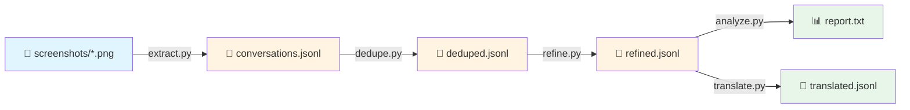
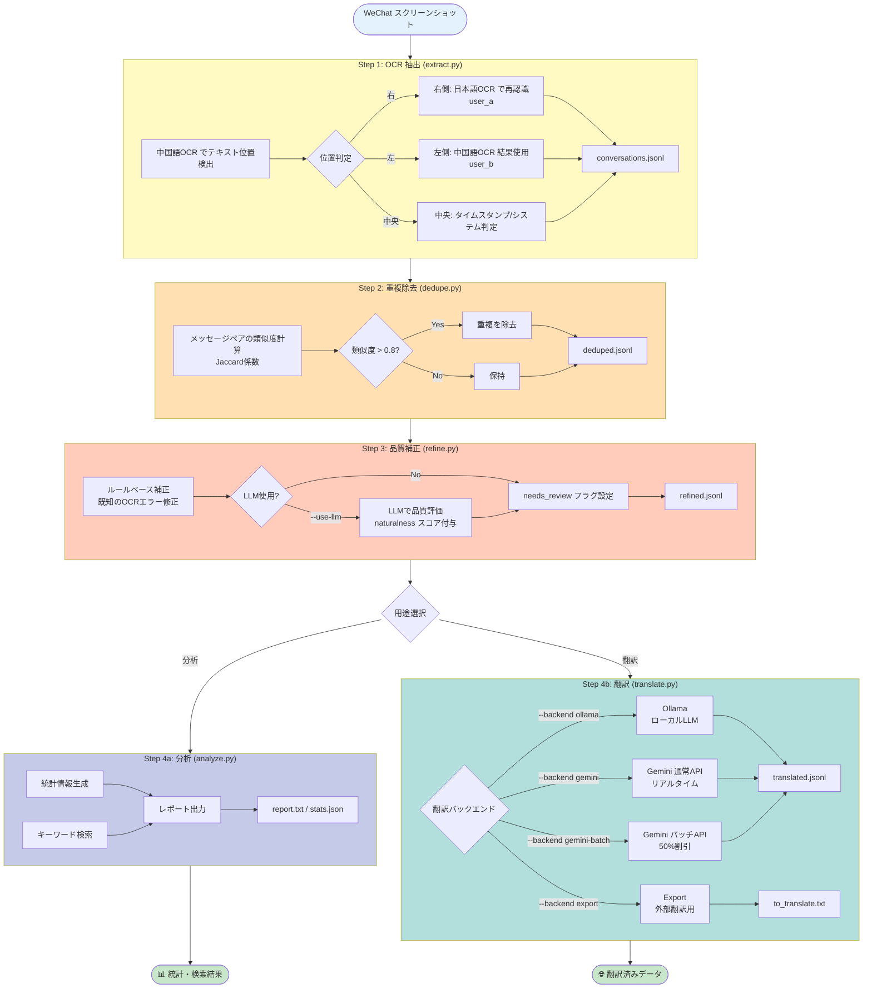

# WeChat Screenshot Conversation Extractor

WeChat のスクリーンショットから会話を自動抽出し、JSONL 形式で出力するツール。

## 概要

このツールは、日本語と中国語の WeChat 会話履歴を分析するために設計されています。

### ユースケース

- 二者間の会話履歴をデータ化
- スクリーンショットからテキストを自動抽出
- 時系列での会話分析
- キーワード検索

### 特徴

- **デュアル OCR モデル**: 中国語モデル（`ch`）と日本語モデル（`japan`）を併用し、高精度な認識を実現
- **位置ベース話者判定**: WeChat の UI（左=ユーザー B、右=ユーザー A）を利用した自動判定
- **GPU 対応**: RTX 3060 Ti 等で高速処理（1 枚あたり約 0.2 秒）
- **タイムスタンプ抽出**: WeChat 形式（`2025-6-18 20:03`等）を自動検出
- **システムメッセージ判定**: 特定のキーワードだけでなく、画面中央のテキストを自動判定
- **中断・再開機能**: チェックポイント対応で大量画像も安心
- **重複除去**: スクロールキャプチャによる重複メッセージを自動除去
- **品質補正**: OCR特有の誤り（`70üTübé`など）や言語不整合を自動検知・修正
- **バッチ翻訳**: Gemini Batch API で50%割引の大量翻訳（自動リソース管理）
- **クリーンアップツール**: Google Files API の不要なファイルを削除

## 環境構築

### 1. 前提条件

- Python 3.9 以上
- CUDA 11.8 または 12.x（GPU 使用時）
- NVIDIA GPU（RTX 3060 Ti 等推奨）

```bash
# CUDA バージョン確認
nvcc --version
```

### 2. Python 環境の準備

```bash
# 仮想環境作成（推奨）
python -m venv venv

# 有効化 (Windows)
.\venv\Scripts\activate

# 有効化 (Linux/Mac)
source venv/bin/activate
```

### 3. 依存パッケージのインストール

**重要**: PaddleOCR v3.x には互換性問題があるため、**v2.9.1** を使用してください。

```bash
# PaddlePaddle GPU版のインストール
# ※ CUDAバージョンに応じて適切なURLを選択

# CUDA 11.8 の場合
pip install paddlepaddle-gpu -i https://www.paddlepaddle.org.cn/packages/stable/cu118/

# CUDA 12.3 の場合
pip install paddlepaddle-gpu -i https://www.paddlepaddle.org.cn/packages/stable/cu123/

# CUDA 12.6 の場合
pip install paddlepaddle-gpu -i https://www.paddlepaddle.org.cn/packages/stable/cu126/

# PaddleOCR（安定版）
pip install "paddleocr==2.9.1"

# その他の依存パッケージ
pip install opencv-python numpy tqdm
```

### 4. 動作確認

```bash
python -c "import paddle; paddle.utils.run_check()"
python -c "from paddleocr import PaddleOCR; print('OK')"
```

## 使用方法

### 処理フロー



#### 詳細フロー



### Step 1: OCR 抽出

```bash
python extract.py --input ./screenshots --output ./output/conversations.jsonl
```

初回実行時に OCR モデルがダウンロードされます（中国語モデル + 日本語モデル）。

#### オプション

```bash
# チェックポイント付き（中断再開可能）
python extract.py \
    --input ./screenshots \
    --output ./output/conversations.jsonl \
    --checkpoint ./output/checkpoint.json

# CPU使用（GPUがない場合）
python extract.py \
    --input ./screenshots \
    --output ./output/conversations.jsonl \
    --no-gpu

# テスト用に最初の100枚だけ処理
python extract.py \
    --input ./screenshots \
    --output ./output/conversations.jsonl \
    --count 100
```

### Step 2: 重複除去

スクロールキャプチャによる重複メッセージを除去します。

```bash
python dedupe.py --input ./output/conversations.jsonl --output ./output/deduped.jsonl
```

### Step 3: 品質補正 (推奨)

OCRの誤認識や不自然な日本語を検知・補正します。

```bash
# 基本的な使用方法 (ルールベースのみ・高速)
python refine.py --input ./output/deduped.jsonl --output ./output/refined.jsonl

# LLMを使用して高精度に判定 (推奨)
# ※ Ollama等のローカルLLMサーバーが必要です
python refine.py \
    --input ./output/deduped.jsonl \
    --output ./output/refined.jsonl \
    --use-llm \
    --llm-model qwen2.5:7b
```

### Step 4: 分析

```bash
# レポート表示
python analyze.py --input ./output/refined.jsonl

# キーワード検索
python analyze.py --input ./output/refined.jsonl --search "炭酸"

# JSON形式で出力
python analyze.py --input ./output/refined.jsonl --json > stats.json
```

### Step 4: 翻訳（オプション）

中国語メッセージに日本語翻訳を追加します。

#### 翻訳バックエンドの比較

| バックエンド | コスト | 速度 | プライバシー | 詳細翻訳 | 用途 |
|-------------|--------|------|-------------|---------|------|
| `ollama` | 無料 | GPU依存 | ローカル完結 | ❌ | プライバシー重視 |
| `gemini` | 有料 | 高速 | クラウド送信 | ✅ | リアルタイム処理、学習用 |
| `gemini-batch` | **50%割引** | 非同期 | クラウド送信 | ❌ | 大量翻訳（推奨） |
| `export` | - | - | - | ❌ | 外部ツール連携 |

#### Ollama使用（ローカルLLM・無料）

```bash
python translate.py \
    --input ./output/refined.jsonl \
    --output ./output/translated.jsonl \
    --backend ollama \
    --model qwen2.5:7b
```

#### Gemini 通常API（リアルタイム）

```bash
# 環境変数 GOOGLE_API_KEY を設定するか、--api-key で指定
export GOOGLE_API_KEY="your_api_key_here"

# コスト最安（gemini-2.5-flash-lite）
python translate.py \
    --input ./output/refined.jsonl \
    --output ./output/translated.jsonl \
    --backend gemini \
    --model gemini-2.5-flash-lite

# バランス重視（gemini-2.0-flash）
python translate.py \
    --input ./output/refined.jsonl \
    --output ./output/translated.jsonl \
    --backend gemini \
    --model gemini-2.0-flash

# テスト実行（最初の10件のみ処理）
python translate.py \
    --input ./output/refined.jsonl \
    --output ./output/test_translated.jsonl \
    --backend gemini \
    --model gemini-2.5-flash-lite \
    --count 10
```

**実行時の確認プロンプト例:**
```
============================================================
【簡易翻訳モード】処理実行の確認
============================================================
モデル: gemini-2.5-flash-lite
送信メッセージ数: 100件
送信データサイズ: 2.02 KB
推定料金: $0.0003 (約0円)
推定トークン: 入力 5900, 出力 3000
============================================================
続行しますか？ [Y/n]:
```

Enterキーまたは `Y` で処理を開始、`n` でキャンセルします。

#### 詳細翻訳モード（言語学習向け）

中国語メッセージの詳細な解説を生成します。単語分解、ピンイン、HSKレベル、ニュアンス分析、返信提案を含む学習用フォーマットです。

```bash
# 詳細翻訳モード（コスト重視 - 推奨）
export GOOGLE_API_KEY="your_api_key_here"
python translate.py \
    --input ./output/refined.jsonl \
    --output ./output/detailed.jsonl \
    --backend gemini \
    --detailed \
    --model gemini-2.5-flash-lite

# 詳細翻訳モード（バランス重視）
python translate.py \
    --input ./output/refined.jsonl \
    --output ./output/detailed.jsonl \
    --backend gemini \
    --detailed \
    --model gemini-2.0-flash

# テスト実行（最初の10件のみ処理）
python translate.py \
    --input ./output/refined.jsonl \
    --output ./output/test_detailed.jsonl \
    --backend gemini \
    --detailed \
    --model gemini-2.5-flash-lite \
    --count 10
```

**出力内容:**
- 原文（中国語テキスト）
- 自然な日本語訳
- 単語・フレーズの詳細解説（ピンイン、HSK級、文法解説）
- 全体のニュアンス分析（文脈・感情・関係性）
- 3パターンの返信提案（優しい/冗談混じり/包容的）

**出力例:**
```markdown
## 原文

晚饭吃点好吃的吧

## 日本語の意味（自然訳）

晩ご飯は何か美味しいものを食べようよ。

## 中国語の分解解説

| 単語 | 品詞 | ピンイン | 意味 | 新HSK | 解説 |
| :-- | :---- | :---------- | :------- | :--- | :----------- |
| 晚饭 | 名詞 | wǎnfàn | 晩ご飯 | 2 | 夜に食べる食事。夕食。 |
| 吃 | 動詞 | chī | 食べる | 1 | 基本的な動詞。食事をする行為。 |
...

## 全体のニュアンス

このメッセージは、相手に晩ご飯を一緒に食べに行こうと提案する内容です。

...

## 日本語での返事案（3パターン）

① 優しい・恋人らしい
うん、いいね！何が食べたい？一緒に考えようか？

② 少し冗談混じり・軽め
おっ、いいね！じゃあ、今日は奮発して高級中華でも行く？(笑)

③ 包容・安心感のある感じ
そうだね、何か美味しいもの食べたいね。ゆっくり話しながら、何にするか決めようか。
```

**コスト:**
- **gemini-2.5-flash-lite**: 100メッセージで約$0.09（約14円） ← 推奨
- **gemini-2.0-flash**: 100メッセージで約$0.20（約32円）
- 通常翻訳の約20倍のトークンを消費

**注意:**
- 詳細翻訳は `gemini` バックエンドのみ対応
- `gemini-batch` では使用不可（簡易翻訳のみ）
- 出力は `text_ja_detailed` フィールドに Markdown 形式で格納
- 処理実行前に確認プロンプトが表示されます（送信データサイズ・推定料金を確認）

#### Gemini バッチAPI（50%割引・大量翻訳推奨）

大量のメッセージを翻訳する場合は、バッチAPIが最もコスト効率が良いです。

```bash
# バッチAPI使用（50%割引・コスト最安）
export GOOGLE_API_KEY="your_api_key_here"
python translate.py \
    --input ./output/refined.jsonl \
    --output ./output/translated.jsonl \
    --backend gemini-batch \
    --model gemini-2.5-flash-lite \
    --batch-size 1000 \
    --poll-interval 60

# バッチAPI使用（50%割引・バランス重視）
python translate.py \
    --input ./output/refined.jsonl \
    --output ./output/translated.jsonl \
    --backend gemini-batch \
    --model gemini-2.0-flash \
    --batch-size 1000 \
    --poll-interval 60

# テスト実行（最初の100件のみ処理）
python translate.py \
    --input ./output/refined.jsonl \
    --output ./output/test_batch.jsonl \
    --backend gemini-batch \
    --model gemini-2.5-flash-lite \
    --batch-size 100 \
    --poll-interval 30 \
    --count 100
```

**改善内容:**
- ✅ **確認プロンプト**: 処理実行前に送信データサイズ・推定料金を表示して確認
- ✅ **処理件数制限**: `--count` オプションでテスト実行が可能
- ✅ **リモートファイルの自動削除**: バッチ処理完了後、Google Files API にアップロードされたファイルを自動削除
- ✅ **バッチ統計情報の表示**: 成功/失敗件数をリアルタイム表示
- ✅ **モデル名の正規化**: プレフィックスの重複を自動回避

**実行例の出力:**
```
バッチ翻訳対象: 12,897件 (モデル: gemini-2.0-flash)
バッチAPIは通常料金の50%割引です

バッチ 1/13 を処理中... (1000件)
リクエストファイルをアップロード中...
アップロード完了: files/xxx
バッチジョブを作成中...
結果を取得中...
  処理完了: 1000/1000 件成功  ← 新機能
リモートファイル削除: files/xxx  ← 新機能
バッチ 1 完了: 1000件翻訳成功

全バッチ処理完了: 12,897/12,897件翻訳成功
```

**バッチサイズの目安:**

| データ量 | 推奨バッチサイズ | 処理時間 |
|---------|----------------|----------|
| <100件 | 通常API推奨 | 即座 |
| 100-1000件 | 200-500件 | 10-30分 |
| 1000-5000件 | 500-1000件 | 20-60分 |
| >5000件 | **1000件** | 30-90分 |

**注意**: バッチAPIは非同期処理のため、完了まで時間がかかる場合があります（通常数分〜90分以内）。

**必要なパッケージ**:
```bash
pip install google-genai
```

#### 料金目安

**簡易翻訳（通常モード）:**

**10,000件の中国語メッセージの場合:**

| バックエンド | モデル | 推定料金 |
|-------------|--------|----------|
| `gemini` | gemini-2.5-flash-lite | 約$0.04（約6円） |
| `gemini` | gemini-2.0-flash | 約$0.15（約24円） |
| `gemini-batch` | gemini-2.5-flash-lite | **約$0.02（約3円）** ← 最安 |
| `gemini-batch` | gemini-2.0-flash | 約$0.08（約12円） |

**refined.jsonl の実データ（12,897件）の場合:**

| バックエンド | モデル | 推定料金 |
|-------------|--------|----------|
| `gemini` | gemini-2.5-flash-lite | 約$0.05（約8円） |
| `gemini` | gemini-2.0-flash | 約$0.08（約13円） |
| `gemini-batch` | gemini-2.5-flash-lite | **約$0.025（約4円）** ← 最安・推奨 |
| `gemini-batch` | gemini-2.0-flash | 約$0.04（約6円） |

**簡易翻訳の推奨モデル:**
- **コスト最優先**: `gemini-2.5-flash-lite` + バッチAPI
- **バランス**: `gemini-2.0-flash` + バッチAPI（実績あり）

※ 平均文字数11文字/メッセージで計算

**詳細翻訳（--detailed使用時）:**

| メッセージ数 | モデル | 推定料金 |
|-------------|--------|----------|
| 100件 | gemini-2.0-flash | 約$0.20（約32円） |
| 1,000件 | gemini-2.0-flash | 約$2.00（約320円） |
| 10,000件 | gemini-2.0-flash | 約$20.00（約3,200円） |

※ 詳細翻訳は通常翻訳の約20倍のトークンを消費

**モデル別料金比較（詳細翻訳・10,000件の場合）:**

| モデル | 入力料金 | 出力料金 | 推定料金（標準） | 推定料金（バッチ） | 特徴 |
|--------|---------|---------|----------------|------------------|------|
| gemini-2.0-flash | $0.015/1M | $0.060/1M | 約$20.00（約3,200円） | 約$10.00（約1,600円） | バランス型 |
| gemini-2.5-flash-lite | $0.10/1M | $0.40/1M | **約$8.83（約1,413円）** | **約$4.42（約707円）** | **最安・推奨** |
| gemini-2.5-flash | $0.30/1M | $2.50/1M | 約$52.49（約8,398円） | 約$26.25（約4,199円） | 高品質 |
| gemini-3-flash-preview | $0.50/1M | $3.00/1M | 約$64.15（約10,264円） | 約$32.08（約5,133円） | 最新 |

**推奨モデル:**
- **コスト重視**: `gemini-2.5-flash-lite` - 最も安価で詳細翻訳に十分な品質
- **バランス重視**: `gemini-2.0-flash` - 実績があり安定した品質
- **品質重視**: `gemini-2.5-flash` または `gemini-3-flash-preview` - より高度な分析が必要な場合

※ 1ドル=160円で計算
※ 平均20文字/メッセージ、入力830トークン、出力2000トークンで計算

#### 外部翻訳用にエクスポート

```bash
python translate.py \
    --input ./output/refined.jsonl \
    --output ./output/to_translate.txt \
    --backend export
```

#### 🧹 リモートファイルのクリーンアップ（オプション）

最新版の translate.py は自動的にリモートファイルを削除しますが、以前のテストで残っているファイルを削除する場合：

```bash
# ファイル一覧を表示
python cleanup_remote_files.py --list

# 24時間以上前のファイルを削除
python cleanup_remote_files.py --delete-old --hours 24

# すべてのファイルを削除
python cleanup_remote_files.py --delete-all
```

**詳細情報:**
- クイックスタート: `CLEANUP_QUICKSTART.md`
- 詳細ガイド: `CLEANUP_GUIDE.md`

**注意:** Google Files API にアップロードされたファイルは48時間後に自動削除されますが、手動削除により即座にストレージを解放できます。

### Step 5: 翻訳結果の表示

翻訳結果（特に詳細翻訳）をブラウザで見やすく表示できるHTMLビューワーを用意しています。

#### ビューワーの起動

```bash
# プロジェクトディレクトリで簡易HTTPサーバーを起動
python -m http.server 8000

# ブラウザで開く
# http://localhost:8000/viewer.html
```

#### 機能

**データ読み込み:**
- ファイルアップロード（ドラッグ&ドロップ対応）
- クイックロードボタン（test_detailed.jsonl、detailed.jsonl、translated.jsonl）

**表示機能:**
- メッセージ一覧と詳細表示の2ペイン構成
- 原文、簡易翻訳、詳細翻訳を見やすく表示
- 詳細翻訳のMarkdown表示（表、リスト、太字対応）

**フィルタ・検索:**
- テキスト検索
- 言語フィルタ（全て/中国語のみ/日本語のみ）
- 詳細翻訳フィルタ（全て/詳細翻訳あり/簡易翻訳のみ）

**キーボードショートカット:**
- `↓` または `j`: 次のメッセージ
- `↑` または `k`: 前のメッセージ

#### 使用例

```bash
# 1. 詳細翻訳を生成
python translate.py \
    --input ./output/refined.jsonl \
    --output ./output/detailed.jsonl \
    --backend gemini \
    --detailed \
    --model gemini-2.5-flash-lite \
    --count 10

# 2. HTTPサーバー起動
python -m http.server 8000

# 3. ブラウザでアクセス
# http://localhost:8000/viewer.html

# 4. 「test_detailed.jsonl」または「detailed.jsonl」ボタンをクリック
```

**スクリーンショット例:**
- 左側: メッセージ一覧（検索・フィルタ機能付き）
- 右側: 選択したメッセージの詳細表示
  - 原文
  - 簡易翻訳
  - 詳細翻訳（単語分解、ニュアンス分析、返信案）

### 一括実行

```bash
./run_pipeline.sh ./screenshots ./output
```

## 出力形式

JSONL 形式で 1 行 1 メッセージ：

```jsonl
{"id": "msg_000001", "speaker": "user_a", "lang": "ja", "type": "text", "text": "美味しそう", "source_file": "CleanShot 2026-01-13 at 19.12.53@2x.png", "confidence": 0.91}
{"id": "msg_000002", "speaker": "user_b", "lang": "zh", "type": "text", "text": "吃晚饭了吗？", "source_file": "CleanShot 2026-01-13 at 19.12.53@2x.png", "confidence": 0.95}
{"id": "msg_000003", "timestamp": "2025-06-18T20:10:00+09:00", "speaker": "user_a", "lang": "ja", "type": "text", "text": "もう食べたよ！カレーラーメン", "source_file": "CleanShot 2026-01-13 at 19.12.53@2x.png", "confidence": 0.99, "naturalness": 1.0}
{"id": "msg_000004", "timestamp": "2025-06-18T20:10:00+09:00", "speaker": "user_b", "lang": "zh", "type": "text", "text": "好吧，原来你也吃的面条。", "source_file": "CleanShot 2026-01-13 at 19.12.53@2x.png", "confidence": 0.99}
```

### フィールド説明

| フィールド    | 説明                          | 例                           |
| ------------- | ----------------------------- | ---------------------------- |
| `id`          | 一意のメッセージ ID           | `msg_000001`                 |
| `timestamp`   | ISO 8601 形式のタイムスタンプ | `2025-06-18T20:10:00+09:00`  |
| `speaker`     | 話者                          | `user_a`, `user_b`, `system` |
| `lang`        | 言語                          | `ja`, `zh`, `system`         |
| `type`        | メッセージタイプ              | `text`, `image`, `system`    |
| `text`        | メッセージ本文                |                              |
| `reply_to`    | 引用返信の元テキスト（任意）  |                              |
| `source_file` | 抽出元ファイル名              |                              |
| `confidence`  | OCR 信頼度スコア（0-1）       | `0.95`                       |
| `naturalness` | 日本語の自然さスコア（0-1）   | `1.0`                        |
| `needs_review`| 確認が必要か                  | `true`                       |
| `text_ja`     | 日本語翻訳（翻訳後）          |                              |
| `text_ja_detailed` | 詳細翻訳（Markdown形式、--detailed使用時） | Markdown形式の学習用解説 |

## ディレクトリ構成

```
wechat_extractor/
├── extract.py                  # メイン抽出スクリプト（デュアルOCR）
├── dedupe.py                   # 重複除去スクリプト
├── analyze.py                  # 分析・統計・検索スクリプト
├── refine.py                   # 品質補正・評価スクリプト
├── translate.py                # 翻訳追加スクリプト（改善版）
├── cleanup_remote_files.py     # Google Files API クリーンアップ（新規）
├── run_pipeline.sh             # 一括実行スクリプト
├── config.yaml                 # 設定ファイル
├── requirements.txt            # 依存パッケージ
├── README.md                   # このファイル
├── REVIEW_translate.md         # translate.py レビュー結果
├── IMPROVEMENTS_APPLIED.md     # 実施した改善の詳細
├── CLEANUP_QUICKSTART.md       # クリーンアップクイックスタート
└── CLEANUP_GUIDE.md            # クリーンアップ詳細ガイド

your_project/
├── screenshots/        # 入力：スクリーンショット
│   ├── CleanShot 2026-01-13 at 19.12.53@2x.png
│   ├── CleanShot 2026-01-13 at 19.12.54@2x.png
│   └── ...
└── output/             # 出力
    ├── conversations.jsonl   # 抽出結果（生データ）
    ├── deduped.jsonl         # 重複除去後
    ├── refined.jsonl         # 補正後
    ├── translated.jsonl      # 翻訳追加後
    ├── checkpoint.json       # チェックポイント
    └── report.txt            # 分析レポート
```

## 処理速度目安

| 環境          | 速度（1 枚あたり） | 10,000 枚の処理時間 |
| ------------- | ------------------ | ------------------- |
| RTX 3060 Ti   | 約 0.2 秒          | 約 30-40 分         |
| RTX 4090      | 約 0.1 秒          | 約 15-20 分         |
| CPU (Core i7) | 約 3-5 秒          | 約 8-14 時間        |

※ デュアル OCR モデル使用時。初回実行時はモデルダウンロードに追加時間がかかります。

## 技術的な仕組み

### デュアル OCR モデル

WeChat の会話は日本語と中国語が混在するため、位置情報に基づいて適切な OCR モデルを選択します：

1. **中国語 OCR**で全テキストの位置を検出
2. 各テキストブロックの位置を判定：
   - **右側**（User A）→ 日本語 OCR で再認識
   - **左側**（User B）→ 中国語 OCR の結果をそのまま使用

```
┌────────────────────────────────────────┐
│              2025-6-18 20:03           │  ← タイムスタンプ（中央）
├────────────────────────────────────────┤
│                          ┌───────────┐ │
│                          │ 美味しそう │ │  ← 右側 = user_a（日本語OCR）
│                          └───────────┘ │
│  ┌─────────────────┐                   │
│  │ 吃晚饭了吗？      │                   │  ← 左側 = user_b（中国語OCR）
│  └─────────────────┘                   │
└────────────────────────────────────────┘
```

### 認識精度の改善結果

| 改善前（中国語 OCR のみ） | 改善後（デュアル OCR）                           |
| ------------------------- | ------------------------------------------------ |
| 羡                        | 羨ましい                                         |
| 食！                      | もう食べたよ！カレーラーメン                     |
| 種類好                    | チリトマトラーメンと言う種類もあってそっちも好き |
| 運動。腹肉無              | 運動するよ。お腹にお肉ついてるから無くしたい     |
| 炭酸買来                  | 炭酸を買いに来た                                 |
| 真暗                      | こっちはもう真っ暗だよ                           |

## トラブルシューティング

### PaddleOCR v3.x のエラー

```
ValueError: Unknown argument: use_gpu
AttributeError: 'AnalysisConfig' object has no attribute 'set_optimization_level'
```

**原因**: PaddleOCR v3.x は API が大幅に変更され、互換性問題があります。

**解決策**: v2.9.1 を使用してください。

```bash
pip uninstall paddleocr paddlex -y
pip install "paddleocr==2.9.1"
```

### PaddlePaddle のインストールエラー

```
ERROR: No matching distribution found for paddlepaddle-gpu==2.6.1
```

**原因**: PyPI や Baidu ミラーには限られたバージョンのみ配布されています。

**解決策**: 公式サーバーからインストール。

```bash
# CUDA 11.8
pip install paddlepaddle-gpu -i https://www.paddlepaddle.org.cn/packages/stable/cu118/
```

### CUDA 関連エラー

```bash
# CUDAバージョンとPaddlePaddleの対応を確認
python -c "import paddle; paddle.utils.run_check()"
```

### 認識精度が低い場合

1. 画像解像度を確認（Retina @2x 推奨）
2. スクリーンショットの品質を確認
3. 一部の誤認識は後処理で修正可能

## 既知の制限事項

1. **タイムスタンプの誤認識**: 一部のタイムスタンプがメッセージとして認識されることがある
2. **メッセージの分割**: 長いメッセージが複数行に分割されることがある
3. **絵文字の認識**: 絵文字は認識されないか、文字化けすることがある
4. **一部の誤字**: 類似した漢字（健康 → 建康、炭酸 → 提酸）が誤認識されることがある

## 🆕 最近の改善

### 2026-01-15: translate.py の改善

1. **詳細翻訳モードの追加** (NEW!)
   - 中国語学習に最適化された詳細解説形式
   - 単語分解（ピンイン、HSKレベル、文法解説）
   - 全体のニュアンス分析（感情・関係性・文化的背景）
   - 3パターンの返信提案（優しい/冗談混じり/包容的）
   - 実装箇所: translate.py:163-344, translate.py:670-689
   - 使用方法: `--detailed` フラグを追加

2. **確認プロンプトの追加** (NEW!)
   - 処理実行前に送信データサイズ・推定料金を表示
   - Enterキーで続行、nでキャンセル
   - 誤操作による不要なコスト発生を防止
   - 実装箇所: translate.py:118-163

3. **処理件数制限機能の追加** (NEW!)
   - `--count` オプションで処理する中国語メッセージ数を制限
   - テスト実行やコスト管理に便利
   - 例: `--count 10` で最初の10件のみ処理
   - 実装箇所: translate.py:609-610

4. **リモートファイルの自動削除** (優先度: 高)
   - Google Files API にアップロードされたファイルを自動削除
   - ストレージクォータの節約とリソース管理の適正化
   - 実装箇所: translate.py:336-341

5. **バッチ統計情報の表示** (優先度: 中)
   - 成功/失敗件数をリアルタイム表示
   - 問題の早期発見が可能
   - 実装箇所: translate.py:279-287

6. **モデル名の正規化** (優先度: 低)
   - `models/` プレフィックスの重複を自動回避
   - より堅牢なコード
   - 実装箇所: translate.py:246-249

### 新規ツール: cleanup_remote_files.py

Google Files API に残っている古いファイルを削除するツールを追加：
- ファイル一覧の表示
- 古いファイルのみ削除（24時間以上前など）
- すべてのファイルを削除
- 安全な削除（確認プロンプト付き）

**詳細情報:**
- レビュー結果: `REVIEW_translate.md`
- 改善内容: `IMPROVEMENTS_APPLIED.md`
- クリーンアップガイド: `CLEANUP_GUIDE.md`, `CLEANUP_QUICKSTART.md`

## 今後の拡張予定

- [ ] セマンティック検索（ベクトル DB 連携）
- [ ] 感情分析
- [ ] 会話のトピック分類
- [ ] Web UI

## ライセンス

MIT License
