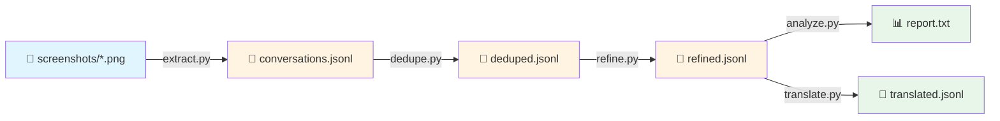
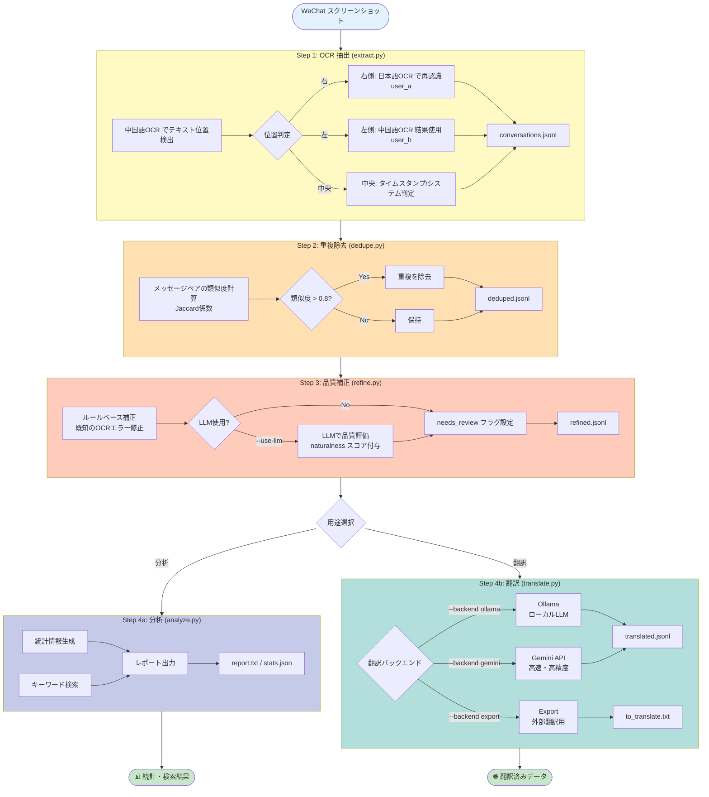

# WeChat Screenshot Conversation Extractor

WeChat のスクリーンショットから会話を自動抽出し、JSONL 形式で出力するツール。

## 概要

このツールは、日本語と中国語の WeChat 会話履歴を分析するために設計されています。

### ユースケース

- 二者間の会話履歴をデータ化
- スクリーンショットからテキストを自動抽出
- 時系列での会話分析
- キーワード検索

### 特徴

- **デュアル OCR モデル**: 中国語モデル（`ch`）と日本語モデル（`japan`）を併用し、高精度な認識を実現
- **位置ベース話者判定**: WeChat の UI（左=ユーザー B、右=ユーザー A）を利用した自動判定
- **GPU 対応**: RTX 3060 Ti 等で高速処理（1 枚あたり約 0.2 秒）
- **タイムスタンプ抽出**: WeChat 形式（`2025-6-18 20:03`等）を自動検出
- **システムメッセージ判定**: 特定のキーワードだけでなく、画面中央のテキストを自動判定
- **中断・再開機能**: チェックポイント対応で大量画像も安心
- **重複除去**: スクロールキャプチャによる重複メッセージを自動除去
- **品質補正**: OCR特有の誤り（`70üTübé`など）や言語不整合を自動検知・修正

## 環境構築

### 1. 前提条件

- Python 3.9 以上
- CUDA 11.8 または 12.x（GPU 使用時）
- NVIDIA GPU（RTX 3060 Ti 等推奨）

```bash
# CUDA バージョン確認
nvcc --version
```

### 2. Python 環境の準備

```bash
# 仮想環境作成（推奨）
python -m venv venv

# 有効化 (Windows)
.\venv\Scripts\activate

# 有効化 (Linux/Mac)
source venv/bin/activate
```

### 3. 依存パッケージのインストール

**重要**: PaddleOCR v3.x には互換性問題があるため、**v2.9.1** を使用してください。

```bash
# PaddlePaddle GPU版のインストール
# ※ CUDAバージョンに応じて適切なURLを選択

# CUDA 11.8 の場合
pip install paddlepaddle-gpu -i https://www.paddlepaddle.org.cn/packages/stable/cu118/

# CUDA 12.3 の場合
pip install paddlepaddle-gpu -i https://www.paddlepaddle.org.cn/packages/stable/cu123/

# CUDA 12.6 の場合
pip install paddlepaddle-gpu -i https://www.paddlepaddle.org.cn/packages/stable/cu126/

# PaddleOCR（安定版）
pip install "paddleocr==2.9.1"

# その他の依存パッケージ
pip install opencv-python numpy tqdm
```

### 4. 動作確認

```bash
python -c "import paddle; paddle.utils.run_check()"
python -c "from paddleocr import PaddleOCR; print('OK')"
```

## 使用方法

### 処理フロー



#### 詳細フロー



### Step 1: OCR 抽出

```bash
python extract.py --input ./screenshots --output ./output/conversations.jsonl
```

初回実行時に OCR モデルがダウンロードされます（中国語モデル + 日本語モデル）。

#### オプション

```bash
# チェックポイント付き（中断再開可能）
python extract.py \
    --input ./screenshots \
    --output ./output/conversations.jsonl \
    --checkpoint ./output/checkpoint.json

# CPU使用（GPUがない場合）
python extract.py \
    --input ./screenshots \
    --output ./output/conversations.jsonl \
    --no-gpu

# テスト用に最初の100枚だけ処理
python extract.py \
    --input ./screenshots \
    --output ./output/conversations.jsonl \
    --count 100
```

### Step 2: 重複除去

スクロールキャプチャによる重複メッセージを除去します。

```bash
python dedupe.py --input ./output/conversations.jsonl --output ./output/deduped.jsonl
```

### Step 3: 品質補正 (推奨)

OCRの誤認識や不自然な日本語を検知・補正します。

```bash
# 基本的な使用方法 (ルールベースのみ・高速)
python refine.py --input ./output/deduped.jsonl --output ./output/refined.jsonl

# LLMを使用して高精度に判定 (推奨)
# ※ Ollama等のローカルLLMサーバーが必要です
python refine.py \
    --input ./output/deduped.jsonl \
    --output ./output/refined.jsonl \
    --use-llm \
    --llm-model qwen2.5:7b
```

### Step 4: 分析

```bash
# レポート表示
python analyze.py --input ./output/refined.jsonl

# キーワード検索
python analyze.py --input ./output/refined.jsonl --search "炭酸"

# JSON形式で出力
python analyze.py --input ./output/refined.jsonl --json > stats.json
```

### Step 4: 翻訳（オプション）

中国語メッセージに日本語翻訳を追加します。

```bash
# Ollama使用（ローカルLLM）
python translate.py \
    --input ./output/refined.jsonl \
    --output ./output/translated.jsonl \
    --backend ollama \
    --model qwen2.5:7b

# Gemini API使用（要API Key・高速）
# 環境変数 GOOGLE_API_KEY を設定するか、--api-key で指定
export GOOGLE_API_KEY="your_api_key_here"
python translate.py \
    --input ./output/refined.jsonl \
    --output ./output/translated.jsonl \
    --backend gemini \
    --model gemini-1.5-flash

# 外部翻訳用にエクスポート
python translate.py \
    --input ./output/refined.jsonl \
    --output ./output/to_translate.txt \
    --backend export
```

### 一括実行

```bash
./run_pipeline.sh ./screenshots ./output
```

## 出力形式

JSONL 形式で 1 行 1 メッセージ：

```jsonl
{"id": "msg_000001", "speaker": "user_a", "lang": "ja", "type": "text", "text": "美味しそう", "source_file": "CleanShot 2026-01-13 at 19.12.53@2x.png", "confidence": 0.91}
{"id": "msg_000002", "speaker": "user_b", "lang": "zh", "type": "text", "text": "吃晚饭了吗？", "source_file": "CleanShot 2026-01-13 at 19.12.53@2x.png", "confidence": 0.95}
{"id": "msg_000003", "timestamp": "2025-06-18T20:10:00+09:00", "speaker": "user_a", "lang": "ja", "type": "text", "text": "もう食べたよ！カレーラーメン", "source_file": "CleanShot 2026-01-13 at 19.12.53@2x.png", "confidence": 0.99, "naturalness": 1.0}
{"id": "msg_000004", "timestamp": "2025-06-18T20:10:00+09:00", "speaker": "user_b", "lang": "zh", "type": "text", "text": "好吧，原来你也吃的面条。", "source_file": "CleanShot 2026-01-13 at 19.12.53@2x.png", "confidence": 0.99}
```

### フィールド説明

| フィールド    | 説明                          | 例                           |
| ------------- | ----------------------------- | ---------------------------- |
| `id`          | 一意のメッセージ ID           | `msg_000001`                 |
| `timestamp`   | ISO 8601 形式のタイムスタンプ | `2025-06-18T20:10:00+09:00`  |
| `speaker`     | 話者                          | `user_a`, `user_b`, `system` |
| `lang`        | 言語                          | `ja`, `zh`, `system`         |
| `type`        | メッセージタイプ              | `text`, `image`, `system`    |
| `text`        | メッセージ本文                |                              |
| `reply_to`    | 引用返信の元テキスト（任意）  |                              |
| `source_file` | 抽出元ファイル名              |                              |
| `confidence`  | OCR 信頼度スコア（0-1）       | `0.95`                       |
| `naturalness` | 日本語の自然さスコア（0-1）   | `1.0`                        |
| `needs_review`| 確認が必要か                  | `true`                       |
| `text_ja`     | 日本語翻訳（翻訳後）          |                              |

## ディレクトリ構成

```
wechat_extractor/
├── extract.py          # メイン抽出スクリプト（デュアルOCR）
├── dedupe.py           # 重複除去スクリプト
├── analyze.py          # 分析・統計・検索スクリプト
├── refine.py           # 品質補正・評価スクリプト
├── translate.py        # 翻訳追加スクリプト
├── run_pipeline.sh     # 一括実行スクリプト
├── config.yaml         # 設定ファイル
├── requirements.txt    # 依存パッケージ
└── README.md           # このファイル

your_project/
├── screenshots/        # 入力：スクリーンショット
│   ├── CleanShot 2026-01-13 at 19.12.53@2x.png
│   ├── CleanShot 2026-01-13 at 19.12.54@2x.png
│   └── ...
└── output/             # 出力
    ├── conversations.jsonl   # 抽出結果（生データ）
    ├── deduped.jsonl         # 重複除去後
    ├── refined.jsonl         # 補正後
    ├── translated.jsonl      # 翻訳追加後
    ├── checkpoint.json       # チェックポイント
    └── report.txt            # 分析レポート
```

## 処理速度目安

| 環境          | 速度（1 枚あたり） | 10,000 枚の処理時間 |
| ------------- | ------------------ | ------------------- |
| RTX 3060 Ti   | 約 0.2 秒          | 約 30-40 分         |
| RTX 4090      | 約 0.1 秒          | 約 15-20 分         |
| CPU (Core i7) | 約 3-5 秒          | 約 8-14 時間        |

※ デュアル OCR モデル使用時。初回実行時はモデルダウンロードに追加時間がかかります。

## 技術的な仕組み

### デュアル OCR モデル

WeChat の会話は日本語と中国語が混在するため、位置情報に基づいて適切な OCR モデルを選択します：

1. **中国語 OCR**で全テキストの位置を検出
2. 各テキストブロックの位置を判定：
   - **右側**（User A）→ 日本語 OCR で再認識
   - **左側**（User B）→ 中国語 OCR の結果をそのまま使用

```
┌────────────────────────────────────────┐
│              2025-6-18 20:03           │  ← タイムスタンプ（中央）
├────────────────────────────────────────┤
│                          ┌───────────┐ │
│                          │ 美味しそう │ │  ← 右側 = user_a（日本語OCR）
│                          └───────────┘ │
│  ┌─────────────────┐                   │
│  │ 吃晚饭了吗？      │                   │  ← 左側 = user_b（中国語OCR）
│  └─────────────────┘                   │
└────────────────────────────────────────┘
```

### 認識精度の改善結果

| 改善前（中国語 OCR のみ） | 改善後（デュアル OCR）                           |
| ------------------------- | ------------------------------------------------ |
| 羡                        | 羨ましい                                         |
| 食！                      | もう食べたよ！カレーラーメン                     |
| 種類好                    | チリトマトラーメンと言う種類もあってそっちも好き |
| 運動。腹肉無              | 運動するよ。お腹にお肉ついてるから無くしたい     |
| 炭酸買来                  | 炭酸を買いに来た                                 |
| 真暗                      | こっちはもう真っ暗だよ                           |

## トラブルシューティング

### PaddleOCR v3.x のエラー

```
ValueError: Unknown argument: use_gpu
AttributeError: 'AnalysisConfig' object has no attribute 'set_optimization_level'
```

**原因**: PaddleOCR v3.x は API が大幅に変更され、互換性問題があります。

**解決策**: v2.9.1 を使用してください。

```bash
pip uninstall paddleocr paddlex -y
pip install "paddleocr==2.9.1"
```

### PaddlePaddle のインストールエラー

```
ERROR: No matching distribution found for paddlepaddle-gpu==2.6.1
```

**原因**: PyPI や Baidu ミラーには限られたバージョンのみ配布されています。

**解決策**: 公式サーバーからインストール。

```bash
# CUDA 11.8
pip install paddlepaddle-gpu -i https://www.paddlepaddle.org.cn/packages/stable/cu118/
```

### CUDA 関連エラー

```bash
# CUDAバージョンとPaddlePaddleの対応を確認
python -c "import paddle; paddle.utils.run_check()"
```

### 認識精度が低い場合

1. 画像解像度を確認（Retina @2x 推奨）
2. スクリーンショットの品質を確認
3. 一部の誤認識は後処理で修正可能

## 既知の制限事項

1. **タイムスタンプの誤認識**: 一部のタイムスタンプがメッセージとして認識されることがある
2. **メッセージの分割**: 長いメッセージが複数行に分割されることがある
3. **絵文字の認識**: 絵文字は認識されないか、文字化けすることがある
4. **一部の誤字**: 類似した漢字（健康 → 建康、炭酸 → 提酸）が誤認識されることがある

## 今後の拡張予定

- [ ] セマンティック検索（ベクトル DB 連携）
- [ ] 感情分析
- [ ] 会話のトピック分類
- [ ] Web UI

## ライセンス

MIT License
