# WeChat Screenshot Conversation Extractor

- [日本語版](./README_ja.md)

A tool that automatically extracts conversations from WeChat screenshots and outputs them in JSONL format.

## Overview

This tool is designed to analyze WeChat conversation history mixed with Japanese and Chinese.

### Use Cases

- Digitalizing conversation history between two parties
- Automatically extracting text from screenshots
- Chronological conversation analysis
- Keyword search

### Features

- **Dual OCR Models**: Uses both Chinese (`ch`) and Japanese (`japan`) models to achieve high recognition accuracy.
- **Location-based Speaker Identification**: Automatically identifies speakers based on WeChat's UI (Left = User B, Right = User A).
- **GPU Support**: High-speed processing with RTX 3060 Ti etc. (approx. 0.2 seconds per image).
- **Timestamp Extraction**: Automatically detects WeChat style timestamps (e.g., `2025-6-18 20:03`).
- **System Message Detection**: Automatically detects system messages based on center alignment, not just keywords.
- **Suspend/Resume Capability**: Supports checkpoints for safe processing of large numbers of images.
- **Deduplication**: Automatically removes duplicate messages caused by scroll captures.
- **Quality Refinement**: Automatically detects and corrects OCR-specific errors (e.g., `70üTübé`) and language inconsistencies.
- **Batch Translation**: Bulk translation with 50% discount using Gemini Batch API (automatic resource management).
- **Cleanup Tool**: Deletes unnecessary files from Google Files API.

## Setup

### 1. Prerequisites

- Python 3.9 or higher
- CUDA 11.8 or 12.x (when using GPU)
- NVIDIA GPU (RTX 3060 Ti or higher recommended)

```bash
# Check CUDA version
nvcc --version
```

### 2. Prepare Python Environment

```bash
# Create virtual environment (Recommended)
python -m venv venv

# Activate (Windows)
.\venv\Scripts\activate

# Activate (Linux/Mac)
source venv/bin/activate
```

### 3. Install Dependencies

**Important**: PaddleOCR v3.x has compatibility issues, so please use **v2.9.1**.

```bash
# Install PaddlePaddle GPU version
# * Select appropriate URL according to CUDA version

# For CUDA 11.8
pip install paddlepaddle-gpu -i https://www.paddlepaddle.org.cn/packages/stable/cu118/

# For CUDA 12.3
pip install paddlepaddle-gpu -i https://www.paddlepaddle.org.cn/packages/stable/cu123/

# For CUDA 12.6
pip install paddlepaddle-gpu -i https://www.paddlepaddle.org.cn/packages/stable/cu126/

# PaddleOCR (Stable version)
pip install "paddleocr==2.9.1"

# Other dependencies
pip install opencv-python numpy tqdm
```

### 4. Verification

```bash
python -c "import paddle; paddle.utils.run_check()"
python -c "from paddleocr import PaddleOCR; print('OK')"
```

## Usage

### Process Flow

```mermaid
graph LR
    A[📁 screenshots/*.png] -->|extract.py| B[📄 conversations.jsonl]
    B -->|dedupe.py| C[📄 deduped.jsonl]
    C -->|refine.py| D[📄 refined.jsonl]
    D -->|analyze.py| E[📊 report.txt]
    D -->|translate.py| F[📄 translated.jsonl]

    style A fill:#e1f5ff
    style B fill:#fff4e1
    style C fill:#fff4e1
    style D fill:#fff4e1
    style E fill:#e8f5e9
    style F fill:#e8f5e9
```



#### Detailed Flow

```mermaid
flowchart TD
    Start([WeChat Screenshots]) --> Extract

    subgraph Extract["Step 1: OCR Extraction (extract.py)"]
        E1[Detect text position with Chinese OCR]
        E2{Position Check}
        E3[Right: Re-recognize with Japanese OCR<br/>user_a]
        E4[Left: Use Chinese OCR result<br/>user_b]
        E5[Center: Timestamp/System Check]
        E1 --> E2
        E2 -->|Right| E3
        E2 -->|Left| E4
        E2 -->|Center| E5
        E3 --> E6[conversations.jsonl]
        E4 --> E6
        E5 --> E6
    end

    Extract --> Dedupe

    subgraph Dedupe["Step 2: Deduplication (dedupe.py)"]
        D1[Calculate similarity of message pairs<br/>Jaccard Index]
        D2{Similarity > 0.8?}
        D3[Remove duplicate]
        D1 --> D2
        D2 -->|Yes| D3
        D2 -->|No| D4[Keep]
        D3 --> D5[deduped.jsonl]
        D4 --> D5
    end

    Dedupe --> Refine

    subgraph Refine["Step 3: Quality Refinement (refine.py)"]
        R1[Rule-based correction<br/>Fix known OCR errors]
        R2{Use LLM?}
        R3[Quality evaluation with LLM<br/>Assign naturalness score]
        R4[Set needs_review flag]
        R1 --> R2
        R2 -->|--use-llm| R3
        R2 -->|No| R4
        R3 --> R4
        R4 --> R5[refined.jsonl]
    end

    Refine --> Branch{Usage Choice}

    subgraph Analyze["Step 4a: Analysis (analyze.py)"]
        A1[Generate Statistics]
        A2[Keyword Search]
        A3[Output Report]
        A1 --> A3
        A2 --> A3
        A3 --> A4[report.txt / stats.json]
    end

    subgraph Translate["Step 4b: Translation (translate.py)"]
        T1{Translation Backend}
        T2[Ollama<br/>Local LLM]
        T3[Gemini Standard API<br/>Real-time]
        T3B[Gemini Batch API<br/>50% Discount]
        T4[Export<br/>For External Tool]
        T1 -->|--backend ollama| T2
        T1 -->|--backend gemini| T3
        T1 -->|--backend gemini-batch| T3B
        T1 -->|--backend export| T4
        T2 --> T5[translated.jsonl]
        T3 --> T5
        T3B --> T5
        T4 --> T6[to_translate.txt]
    end

    Branch -->|Analysis| Analyze
    Branch -->|Translation| Translate

    Analyze --> End1([📊 Stats & Search Results])
    Translate --> End2([🌐 Translated Data])

    style Start fill:#e3f2fd
    style End1 fill:#c8e6c9
    style End2 fill:#c8e6c9
    style Extract fill:#fff9c4
    style Dedupe fill:#ffe0b2
    style Refine fill:#ffccbc
    style Analyze fill:#c5cae9
    style Translate fill:#b2dfdb
```



### Step 1: OCR Extraction

```bash
python extract.py --input ./screenshots --output ./output/conversations.jsonl
```

OCR models will be downloaded on the first run (Chinese model + Japanese model).

#### Options

```bash
# With checkpoint (Resumable)
python extract.py \
    --input ./screenshots \
    --output ./output/conversations.jsonl \
    --checkpoint ./output/checkpoint.json

# Use CPU (If no GPU)
python extract.py \
    --input ./screenshots \
    --output ./output/conversations.jsonl \
    --no-gpu

# Process only first 100 images for testing
python extract.py \
    --input ./screenshots \
    --output ./output/conversations.jsonl \
    --count 100
```

### Step 2: Deduplication

Removes duplicate messages caused by scroll captures.

```bash
python dedupe.py --input ./output/conversations.jsonl --output ./output/deduped.jsonl
```

### Step 3: Quality Refinement (Recommended)

Detects and corrects OCR misrecognitions and unnatural Japanese.

```bash
# Basic usage (Rule-based only, Fast)
python refine.py --input ./output/deduped.jsonl --output ./output/refined.jsonl

# High precision judgment using LLM (Recommended)
# * Requires local LLM server like Ollama
python refine.py \
    --input ./output/deduped.jsonl \
    --output ./output/refined.jsonl \
    --use-llm \
    --llm-model qwen2.5:7b
```

### Step 3.5: Split by Date (Optional)

Splits large conversation data by date for management and translation.

```bash
python split_by_date.py \
    --input ./output/refined.jsonl \
    --output-dir ./output/daily
```

**Output Example:**
```
./output/daily/2025-05-25.jsonl  (233 items)
./output/daily/2025-05-26.jsonl  (169 items)
./output/daily/2025-06-18.jsonl  (371 items)
...
```

**Benefits:**
- Easy management by date
- Translate only specific periods
- Partial processing of large data

### Step 4: Analysis

```bash
# Show report
python analyze.py --input ./output/refined.jsonl

# Keyword search
python analyze.py --input ./output/refined.jsonl --search "Carbonated"

# Output in JSON format
python analyze.py --input ./output/refined.jsonl --json > stats.json
```

### Step 5: Translation (Optional)

Adds Japanese translations to Chinese messages.

#### Translation Backend Comparison

| Backend | Cost | Speed | Privacy | Detailed Translation | Use Case |
|-------------|--------|------|-------------|---------|------|
| `ollama` | Free | GPU Dep | Local Only | ❌ | Privacy Focused |
| `gemini` | Paid | Fast | Cloud Sent | ✅ | Real-time, Learning |
| `gemini-batch` | **50% OFF** | Async | Cloud Sent | ❌ | Bulk Translation (Recommended) |
| `export` | - | - | - | ❌ | External Tools |

#### Using Ollama (Local LLM, Free)

**Single File Processing:**
```bash
python translate.py \
    --input ./output/refined.jsonl \
    --output ./output/translated.jsonl \
    --backend ollama \
    --model qwen2.5:7b
```

**Directory Processing (Batch translation by date):**
```bash
# Process all dates
python translate.py \
    --input-dir ./output/daily \
    --output-dir ./output/translated \
    --backend ollama \
    --model qwen2.5:7b

# Process only first 10 days (For testing)
python translate.py \
    --input-dir ./output/daily \
    --output-dir ./output/translated \
    --backend ollama \
    --model qwen2.5:7b \
    --count 10
```

> [!NOTE]
> When processing a directory, the `--count` option limits by **number of days** (e.g., `--count 10` processes files for the first 10 days). For single file processing, it limits by **number of messages** as before.


#### Gemini Standard API (Real-time)

```bash
# Set GOOGLE_API_KEY env var or specify via --api-key
export GOOGLE_API_KEY="your_api_key_here"

# Lowest Cost (gemini-2.5-flash-lite)
python translate.py \
    --input ./output/refined.jsonl \
    --output ./output/translated.jsonl \
    --backend gemini \
    --model gemini-2.5-flash-lite

# Balance Focused (gemini-2.0-flash)
python translate.py \
    --input ./output/refined.jsonl \
    --output ./output/translated.jsonl \
    --backend gemini \
    --model gemini-2.0-flash

# Test Run (Process only first 10 items)
python translate.py \
    --input ./output/refined.jsonl \
    --output ./output/test_translated.jsonl \
    --backend gemini \
    --model gemini-2.5-flash-lite \
    --count 10
```

**Execution Confirmation Prompt Example:**
```
============================================================
[Simple Translation Mode] Execution Confirmation
============================================================
Model: gemini-2.5-flash-lite
Message Count: 100 items
Data Size: 2.02 KB
Est. Cost: $0.0003 (approx. 0 JPY)
Est. Tokens: Input 5900, Output 3000
============================================================
Continue? [Y/n]:
```

Press Enter or `Y` to start, `n` to cancel.

#### Detailed Translation Mode (For Language Learning)

Generates detailed explanations for Chinese messages. Includes vocabulary breakdown, Pinyin, HSK level, nuance analysis, and reply suggestions in a learning format.

```bash
# Detailed Mode (Cost Focused - Recommended)
export GOOGLE_API_KEY="your_api_key_here"
python translate.py \
    --input ./output/refined.jsonl \
    --output ./output/detailed.jsonl \
    --backend gemini \
    --detailed \
    --model gemini-2.5-flash-lite

# Detailed Mode (Balance Focused)
python translate.py \
    --input ./output/refined.jsonl \
    --output ./output/detailed.jsonl \
    --backend gemini \
    --detailed \
    --model gemini-2.0-flash

# Test Run (Process only first 10 items)
python translate.py \
    --input ./output/refined.jsonl \
    --output ./output/test_detailed.jsonl \
    --backend gemini \
    --detailed \
    --model gemini-2.5-flash-lite \
    --count 10
```

**Output Content:**
- Original Text (Chinese)
- Natural Japanese Translation
- Vocabulary/Phrase Detailed Explanation (Pinyin, HSK Level, Grammar)
- Overall Nuance Analysis (Context, Emotion, Relationship)
- 3 Reply Suggestions (Gentle/Joking/Inclusive)

**Output Example:**
```markdown
## Original Text

晚饭吃点好吃的吧

## Japanese Meaning (Natural)

晩ご飯は何か美味しいものを食べようよ。

## Chinese Decomposition

| Word | Part of Speech | Pinyin | Meaning | New HSK | Explanation |
| :-- | :---- | :---------- | :------- | :--- | :----------- |
| 晚饭 | Noun | wǎnfàn | Dinner | 2 | Meal eaten in the evening. |
| 吃 | Verb | chī | Eat | 1 | Basic verb. Act of eating. |
...

## Overall Nuance

This message proposes going out to eat something good for dinner together.

...

## Reply Suggestions in Japanese (3 Patterns)

① Gentle/Lovers
うん、いいね！何が食べたい？一緒に考えようか？

② Joking/Light
おっ、いいね！じゃあ、今日は奮発して高級中華でも行く？(笑)

③ Inclusive/Reassuring
そうだね、何か美味しいもの食べたいね。ゆっくり話しながら、何にするか決めようか。
```

**Cost:**
- **gemini-2.5-flash-lite**: Approx. $0.09 (approx. 14 JPY) per 100 messages <-- Recommended
- **gemini-2.0-flash**: Approx. $0.20 (approx. 32 JPY) per 100 messages
- Consumes about 20 times more tokens than normal translation.

**Note:**
- Detailed translation is only supported by `gemini` backend.
- Not available with `gemini-batch` (Simple translation only).
- Output is stored in Markdown format in `text_ja_detailed` field.
- A confirmation prompt is displayed before execution (check data size and estimated cost).

#### Gemini Batch API (50% OFF - Recommended for Bulk Translation)

Batch API is the most cost-effective way to translate large amounts of messages.

```bash
# Use Batch API (50% OFF, Lowest Cost)
export GOOGLE_API_KEY="your_api_key_here"
python translate.py \
    --input ./output/refined.jsonl \
    --output ./output/translated.jsonl \
    --backend gemini-batch \
    --model gemini-2.5-flash-lite \
    --batch-size 1000 \
    --poll-interval 60

# Use Batch API (50% OFF, Balance Focused)
python translate.py \
    --input ./output/refined.jsonl \
    --output ./output/translated.jsonl \
    --backend gemini-batch \
    --model gemini-2.0-flash \
    --batch-size 1000 \
    --poll-interval 60

# Test Run (Process only first 100 items)
python translate.py \
    --input ./output/refined.jsonl \
    --output ./output/test_batch.jsonl \
    --backend gemini-batch \
    --model gemini-2.5-flash-lite \
    --batch-size 100 \
    --poll-interval 30 \
    --count 100
```

**Improvements:**
- ✅ **Confirmation Prompt**: Displays data size and estimated cost before execution.
- ✅ **Count Limit**: Test execution possible with `--count` option.
- ✅ **Auto-Verify Remote Files**: Automatically deletes uploaded files after batch completion.
- ✅ **Batch Statistics**: Real-time display of success/failure counts.
- ✅ **Model Name Normalization**: Automatically avoids prefix duplication.

**Execution Output Example:**
```
Batch Translation Target: 12,897 items (Model: gemini-2.0-flash)
Batch API is 50% off standard rates

Processing Batch 1/13... (1000 items)
Uploading request file...
Upload Complete: files/xxx
Creating batch job...
Retrieving results...
  Processing Complete: 1000/1000 items successful  <-- New
Remote file deleted: files/xxx  <-- New
Batch 1 Complete: 1000 translations successful

All batches complete: 12,897/12,897 translations successful
```

**Batch Size Guidelines:**

| Data Volume | Recommended Batch Size | Processing Time |
|---------|----------------|----------|
| <100 items | Standard API | Instant |
| 100-1000 items | 200-500 items | 10-30 mins |
| 1000-5000 items | 500-1000 items | 20-60 mins |
| >5000 items | **1000 items** | 30-90 mins |

**Note**: Batch API is asynchronous, so it may take time to complete (usually minutes to 90 mins).

**Required Package**:
```bash
pip install google-genai
```

#### Cost Estimates

**Simple Translation (Normal Mode):**

**For 10,000 Chinese messages:**

| Backend | Model | Est. Cost |
|-------------|--------|----------|
| `gemini` | gemini-2.5-flash-lite | Approx. $0.04 (approx. 6 JPY) |
| `gemini` | gemini-2.0-flash | Approx. $0.15 (approx. 24 JPY) |
| `gemini-batch` | gemini-2.5-flash-lite | **Approx. $0.02 (approx. 3 JPY)** <-- Lowest |
| `gemini-batch` | gemini-2.0-flash | Approx. $0.08 (approx. 12 JPY) |

**For actual refined.jsonl data (12,897 items):**

| Backend | Model | Est. Cost |
|-------------|--------|----------|
| `gemini` | gemini-2.5-flash-lite | Approx. $0.05 (approx. 8 JPY) |
| `gemini` | gemini-2.0-flash | Approx. $0.08 (approx. 13 JPY) |
| `gemini-batch` | gemini-2.5-flash-lite | **Approx. $0.025 (approx. 4 JPY)** <-- Lowest / Recommended |
| `gemini-batch` | gemini-2.0-flash | Approx. $0.04 (approx. 6 JPY) |

**Recommended Model for Simple Translation:**
- **Cost Priority**: `gemini-2.5-flash-lite` + Batch API
- **Balance**: `gemini-2.0-flash` + Batch API (Proven)

* Calculated based on average 11 characters/message

**Detailed Translation (with --detailed):**

| Message Count | Model | Est. Cost |
|-------------|--------|----------|
| 100 items | gemini-2.0-flash | Approx. $0.20 (approx. 32 JPY) |
| 1,000 items | gemini-2.0-flash | Approx. $2.00 (approx. 320 JPY) |
| 10,000 items | gemini-2.0-flash | Approx. $20.00 (approx. 3,200 JPY) |

* Detailed translation consumes approx. 20x more tokens than normal translation.

**Model Cost Comparison (Detailed Translation - 10,000 items):**

| Model | Input Cost | Output Cost | Est. Cost (Std) | Est. Cost (Batch) | Features |
|--------|---------|---------|----------------|------------------|------|
| gemini-2.0-flash | $0.015/1M | $0.060/1M | Approx. $20.00 | Approx. $10.00 | Balanced |
| gemini-2.5-flash-lite | $0.10/1M | $0.40/1M | **Approx. $8.83** | **Approx. $4.42** | **Lowest / Recommended** |
| gemini-2.5-flash | $0.30/1M | $2.50/1M | Approx. $52.49 | Approx. $26.25 | High Quality |
| gemini-3-flash-preview | $0.50/1M | $3.00/1M | Approx. $64.15 | Approx. $32.08 | Latest |

**Recommended Models:**
- **Cost Priority**: `gemini-2.5-flash-lite` - Cheapest, good enough for detailed translation.
- **Balance Priority**: `gemini-2.0-flash` - Proven, stable quality.
- **Quality Priority**: `gemini-2.5-flash` or `gemini-3-flash-preview` - For advanced analysis.

* Calculated at $1 = 160 JPY
* Calculated based on avg 20 chars/msg, input 830 tokens, output 2000 tokens.

#### Export for External Translation

```bash
python translate.py \
    --input ./output/refined.jsonl \
    --output ./output/to_translate.txt \
    --backend export
```

#### 🧹 Remote File Cleanup (Optional)

The latest version of translate.py automatically deletes remote files, but to manually delete files left over from previous tests:

```bash
# List files
python cleanup_remote_files.py --list

# Delete files older than 24 hours
python cleanup_remote_files.py --delete-old --hours 24

# Delete all files
python cleanup_remote_files.py --delete-all
```

**More Info:**
- Quickstart: `CLEANUP_QUICKSTART.md`
- Detailed Guide: `CLEANUP_GUIDE.md`

**Note:** Files uploaded to Google Files API are automatically deleted after 48 hours, but manual deletion frees up storage immediately.

### Step 5: View Translation Results

An HTML viewer is available to easily view translation results (especially detailed translations) in a browser.

#### Launch Viewer

```bash
# Start simple HTTP server in project directory
python -m http.server 8000

# Open in browser
# http://localhost:8000/viewer.html
```

#### Features

**Data Loading:**
- File Upload (Drag & Drop supported)
- Quick Load Buttons (test_detailed.jsonl, detailed.jsonl, translated.jsonl)

**Display Features:**
- 2-pane layout (Message list & Details)
- Clear display of Original, Simple Translation, and Detailed Translation
- Markdown rendering for detailed translation (Tables, Lists, Bold supported)

**Filter & Search:**
- Text Search
- Language Filter (All / Chinese Only / Japanese Only)
- Detailed Translation Filter (All / With Detailed Translation / Simple Translation Only)

**Keyboard Shortcuts:**
- `↓` or `j`: Next message
- `↑` or `k`: Previous message

#### Usage Example

```bash
# 1. Generate detailed translation
python translate.py \
    --input ./output/refined.jsonl \
    --output ./output/detailed.jsonl \
    --backend gemini \
    --detailed \
    --model gemini-2.5-flash-lite \
    --count 10

# 2. Start HTTP server
python -m http.server 8000

# 3. Access in browser
# http://localhost:8000/viewer.html

# 4. Click "test_detailed.jsonl" or "detailed.jsonl" button
```

**Screenshot Example:**
- Left: Message List (With Search/Filter)
- Right: Detailed View of Selected Message
  - Original
  - Simple Translation
  - Detailed Translation (Vocabulary breakdown, Nuance analysis, Reply suggestions)

### Bulk Execution

```bash
./run_pipeline.sh ./screenshots ./output
```

## Output Format

JSONL format with 1 message per line:

```jsonl
{"id": "msg_000001", "speaker": "user_a", "lang": "ja", "type": "text", "text": "美味しそう", "source_file": "CleanShot 2026-01-13 at 19.12.53@2x.png", "confidence": 0.91}
{"id": "msg_000002", "speaker": "user_b", "lang": "zh", "type": "text", "text": "吃晚饭了吗？", "source_file": "CleanShot 2026-01-13 at 19.12.53@2x.png", "confidence": 0.95}
{"id": "msg_000003", "timestamp": "2025-06-18T20:10:00+09:00", "speaker": "user_a", "lang": "ja", "type": "text", "text": "もう食べたよ！カレーラーメン", "source_file": "CleanShot 2026-01-13 at 19.12.53@2x.png", "confidence": 0.99, "naturalness": 1.0}
{"id": "msg_000004", "timestamp": "2025-06-18T20:10:00+09:00", "speaker": "user_b", "lang": "zh", "type": "text", "text": "好吧，原来你也吃的面条。", "source_file": "CleanShot 2026-01-13 at 19.12.53@2x.png", "confidence": 0.99}
```

### Field Description

| Field | Description | Example |
| ------------- | ----------------------------- | ---------------------------- |
| `id` | Unique Message ID | `msg_000001` |
| `timestamp` | Timestamp in ISO 8601 | `2025-06-18T20:10:00+09:00` |
| `speaker` | Speaker | `user_a`, `user_b`, `system` |
| `lang` | Language | `ja`, `zh`, `system` |
| `type` | Message Type | `text`, `image`, `system` |
| `text` | Message Body | |
| `reply_to` | Source text for citation reply (optional) | |
| `source_file` | Source Filename | |
| `confidence` | OCR Confidence Score (0-1) | `0.95` |
| `naturalness` | Japanese Naturalness Score (0-1) | `1.0` |
| `needs_review`| Needs Review | `true` |
| `text_ja` | Japanese Translation (After translation) | |
| `text_ja_detailed` | Detailed Translation (Markdown, with --detailed) | Learning explanation in Markdown |

## Directory Structure

```
wechat_extractor/
├── extract.py                  # Main extraction script (Dual OCR)
├── dedupe.py                   # Deduplication script
├── refine.py                   # Quality refinement/evaluation script
├── split_by_date.py            # Daily split script (New)
├── analyze.py                  # Analysis/Stats/Search script
├── translate.py                # Translation script (Directory processing supported)
├── cleanup_remote_files.py     # Google Files API Cleanup (New)
├── run_pipeline.sh             # Batch execution script
├── config.yaml                 # Configuration file
├── requirements.txt            # Dependencies
├── README.md                   # This file
├── REVIEW_translate.md         # translate.py review results
├── IMPROVEMENTS_APPLIED.md     # Details of improvements applied
├── CLEANUP_QUICKSTART.md       # Cleanup Quickstart
└── CLEANUP_GUIDE.md            # Cleanup Detailed Guide

your_project/
├── screenshots/        # Input: Screenshots
│   ├── CleanShot 2026-01-13 at 19.12.53@2x.png
│   ├── CleanShot 2026-01-13 at 19.12.54@2x.png
│   └── ...
└── output/             # Output
    ├── conversations.jsonl   # Extraction result (Raw)
    ├── deduped.jsonl         # After deduplication
    ├── refined.jsonl         # After refinement
    ├── daily/                # Split by date (New)
    │   ├── 2025-05-25.jsonl
    │   ├── 2025-05-26.jsonl
    │   └── ...
    ├── translated/           # Directory translation results (New)
    │   ├── 2025-05-25_translated.jsonl
    │   ├── 2025-05-26_translated.jsonl
    │   └── ...
    ├── checkpoint.json       # Checkpoint
    └── report.txt            # Analysis report
```

## Processing Speed Estimation

| Environment | Speed (per image) | Time for 10,000 images |
| ------------- | ------------------ | ------------------- |
| RTX 3060 Ti | Approx. 0.2s | Approx. 30-40 mins |
| RTX 4090 | Approx. 0.1s | Approx. 15-20 mins |
| CPU (Core i7) | Approx. 3-5s | Approx. 8-14 hours |

* When using Dual OCR Models. First run will take extra time for model download.

## Technical Details

### Dual OCR Models

Since WeChat conversations mix Japanese and Chinese, the appropriate OCR model is selected based on location information:

1. Detect all text positions with **Chinese OCR**
2. Determine position of each text block:
   - **Right Side** (User A) -> Re-recognize with Japanese OCR
   - **Left Side** (User B) -> Use Chinese OCR result as is

```
┌────────────────────────────────────────┐
│              2025-6-18 20:03           │  ← Timestamp (Center)
├────────────────────────────────────────┤
│                          ┌───────────┐ │
│                          │ 美味しそう │ │  ← Right = user_a (Japanese OCR)
│                          └───────────┘ │
│  ┌─────────────────┐                   │
│  │ 吃晚饭了吗？      │                   │  ← Left = user_b (Chinese OCR)
│  └─────────────────┘                   │
└────────────────────────────────────────┘
```

### Recognition Accuracy Improvements

| Before (Chinese OCR Only) | After (Dual OCR) |
| ------------------------- | ------------------------------------------------ |
| 羡                        | 羨ましい                                         |
| 食！                      | もう食べたよ！カレーラーメン                     |
| 種類好                    | チリトマトラーメンと言う種類もあってそっちも好き |
| 運動。腹肉無              | 運動するよ。お腹にお肉ついてるから無くしたい     |
| 炭酸買来                  | 炭酸を買いに来た                                 |
| 真暗                      | こっちはもう真っ暗だよ                           |

## Troubleshooting

### PaddleOCR v3.x Errors

```
ValueError: Unknown argument: use_gpu
AttributeError: 'AnalysisConfig' object has no attribute 'set_optimization_level'
```

**Cause**: PaddleOCR v3.x has significant API changes and compatibility issues.

**Solution**: Please use v2.9.1.

```bash
pip uninstall paddleocr paddlex -y
pip install "paddleocr==2.9.1"
```

### PaddlePaddle Installation Errors

```
ERROR: No matching distribution found for paddlepaddle-gpu==2.6.1
```

**Cause**: Only limited versions are distributed on PyPI and Baidu mirrors.

**Solution**: Install from the official server.

```bash
# CUDA 11.8
pip install paddlepaddle-gpu -i https://www.paddlepaddle.org.cn/packages/stable/cu118/
```

### CUDA Related Errors

```bash
# Check correspondence between CUDA version and PaddlePaddle
python -c "import paddle; paddle.utils.run_check()"
```

### Low Recognition Accuracy

1. Check image resolution (Retina @2x recommended)
2. Check screenshot quality
3. Some misrecognitions can be corrected in post-processing

## Known Limitations

1. **Timestamp Misrecognition**: Some timestamps may be recognized as messages.
2. **Message Splitting**: Long messages may be split into multiple lines.
3. **Emoji Recognition**: Emojis may not be recognized or may be garbled.
4. **Some Typos**: Similar Kanji (e.g. 健康 -> 建康, 炭酸 -> 提酸) may be misrecognized.

## 🆕 Recent Improvements

### 2026-01-15: translate.py Improvements

1. **Added Detailed Translation Mode** (NEW!)
   - Detailed explanation format optimized for Chinese learning
   - Word decomposition (Pinyin, HSK Level, Grammar explanation)
   - Overall nuance analysis (Emotion, Relationship, Cultural background)
   - 3 reply suggestions (Gentle/Joking/Inclusive)
   - Implementation: translate.py:163-344, translate.py:670-689
   - Usage: Add `--detailed` flag

2. **Added Confirmation Prompt** (NEW!)
   - Displays data size and estimated cost before execution
   - Enter to continue, n to cancel
   - Prevents unnecessary costs due to accidental operation
   - Implementation: translate.py:118-163

3. **Added Count Limit Function** (NEW!)
   - Limit the number of Chinese messages processed with `--count` option
   - Convenient for test runs and cost management
   - Example: `--count 10` processes only the first 10 items
   - Implementation: translate.py:609-610

4. **Automatic Remote File Deletion** (Priority: High)
   - Automatically deletes files uploaded to Google Files API
   - Saves storage quota and optimizes resource management
   - Implementation: translate.py:336-341

5. **Batch Statistics Display** (Priority: Medium)
   - Real-time display of success/failure counts
   - Allows early detection of issues
   - Implementation: translate.py:279-287

6. **Model Name Normalization** (Priority: Low)
   - Automatically avoids duplication of `models/` prefix
   - More robust code
   - Implementation: translate.py:246-249

### New Tool: cleanup_remote_files.py

Added a tool to delete old files remaining in Google Files API:
- List files
- Delete only old files (e.g. older than 24 hours)
- Delete all files
- Safe deletion (with confirmation prompt)

**More Info:**
- Review Results: `REVIEW_translate.md`
- Improvement Details: `IMPROVEMENTS_APPLIED.md`
- Cleanup Guide: `CLEANUP_GUIDE.md`, `CLEANUP_QUICKSTART.md`

## Future Roadmap

- [ ] Semantic Search (Vector DB integration)
- [ ] Sentiment Analysis
- [ ] Conversation Topic Classification
- [ ] Web UI

## License

MIT License
